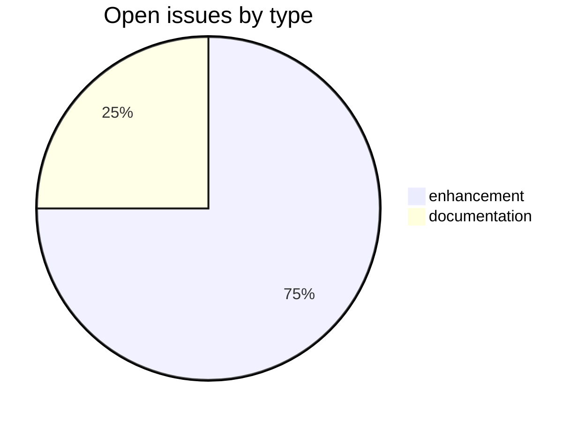
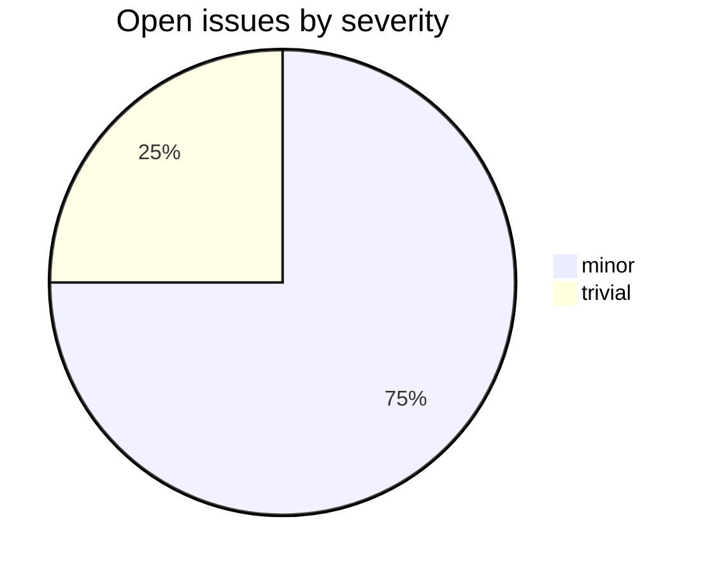

# hwnorm2

_Created: 05-07-2026 · Last updated: 11-07-2026_

A CDSL **processing-tool** repository in the [Sanskrit Lexicon](https://github.com/sanskrit-lexicon) project. `hwnorm2` builds a cross-dictionary **headword-normalization index** — the SQLite database [`keydoc/keydoc_glob1.sqlite`](https://github.com/sanskrit-lexicon/hwnorm2/tree/main/keydoc) — that maps normalized headword keys across the Cologne dictionaries, and is consumed by the `dalglob1.php` global-lookup sample in [csl-apidev](https://github.com/sanskrit-lexicon/csl-apidev).

## What it does

- Iterates over the ~37 dictionary codes listed in [`dictlist.txt`](https://github.com/sanskrit-lexicon/hwnorm2/blob/main/dictlist.txt).
- For each dictionary, extracts distinct headwords from the corresponding [`csl-orig`](https://github.com/sanskrit-lexicon/csl-orig) digitization (`v02/<dict>/<dict>.txt`) and normalizes them.
- Merges the per-dictionary keys into `keydoc/keydoc_glob1.sqlite` for use by the global headword-lookup interface.

## Rebuilding the index

The recreation steps (local XAMPP and Cologne-server variants) are documented in [`readme.txt`](https://github.com/sanskrit-lexicon/hwnorm2/blob/main/readme.txt); the detailed per-step technical walkthrough is in [`readme_tech.txt`](https://github.com/sanskrit-lexicon/hwnorm2/blob/main/readme_tech.txt). The driver scripts are [`redo.sh`](https://github.com/sanskrit-lexicon/hwnorm2/blob/main/redo.sh) and [`redo_glob1.sh`](https://github.com/sanskrit-lexicon/hwnorm2/blob/main/redo_glob1.sh), with the per-dictionary logic under [`keydoc/`](https://github.com/sanskrit-lexicon/hwnorm2/tree/main/keydoc).

## Tech Stack

- **Language**: Python (extraction/normalization), shell (drivers), consumed by PHP in csl-apidev.
- **Output**: SQLite (`keydoc_glob1.sqlite`).
- **Pipeline conventions**: see the [Cologne tooling runbook](https://github.com/sanskrit-lexicon/csl-observatory/blob/main/runbook/cologne-tooling-runbook.md).

## Issues Overview

Snapshot 11-07-2026: **4** open, **1** closed.

### By Milestone

| Milestone | Open | Closed | Total |
|---|---:|---:|---:|
| API Stability | 0 | 0 | 0 |
| User Experience | 3 | 0 | 3 |
| Data Quality | 0 | 0 | 0 |
| Developer Experience | 1 | 0 | 1 |
| Community | 0 | 0 | 0 |

### By Type

### By Severity

## GitHub Issue Conventions

Follows the [Cologne tooling-repo taxonomy](https://github.com/sanskrit-lexicon/csl-observatory/blob/main/runbook/cologne-tooling-runbook.md):

- **17 type labels** across 5 categories
- **4 severity levels**: trivial, minor, major, critical
- **5 milestones**: API Stability, User Experience, Data Quality, Developer Experience, Community
- **Domain labels** scoped to processing-tool: `domain:morphology`, `domain:normalization`, `domain:lookup`
- **Org Project**: [Tooling Roadmap](https://github.com/orgs/sanskrit-lexicon/projects/9)

Repo-specific agent guidance lives in [`CLAUDE.md`](https://github.com/sanskrit-lexicon/hwnorm2/blob/main/CLAUDE.md).

---

_Dr. Mārcis Gasūns_
